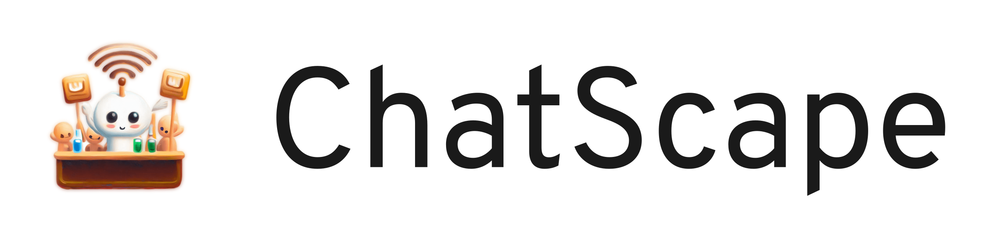

# ChatScape



Scalable serverless chat, a uni project for the HdM cloud course.

[](https://github.com/pojntfx/chatscape/actions/workflows/hydrun.yaml)

## Overview

ChatScape is a chat application, designed as a hands-on approach to dive deep into AWS. You can find out more about the project in the [accompanying blog post](./docs/blogpost.md).

## Reference

### Tables

#### Contacts

- `id`: UUID for the contact.
- `name`: Name of the contact.
- `email`: Email of the contact.
- `avatar`: URL or key to the avatar image.
- `blocked`: Boolean indicating if the contact is blocked.
- `namespace`: User namespace.
- `report`: Text that a user reported for the contact

#### Messages

- `date`: Timestamp of the message
- `body`: Content of the message.
- `senderNamespace`: Namespace of the message sender.
- `recipientNamespace`: Namespace of the message receiver.

### Lambdas

#### addContact

- **Path**: `/add-contact`
- **Method**: `POST`
- **Functionality:**
  - Read namespace from token
  - Receive `name`, `email` in the request.
  - Generate a unique ID for the contact.
  - Insert the contact into the `Contacts` table.
  - Return the created contact.

#### getContacts

- **Path**: `/contacts`
- **Method**: `POST`
- **Functionality:**
  - Read namespace from token
  - Query the `Contacts` table for all contacts with the namespace
  - Return the list of contacts.

#### blockContact

- **Path**: `/block-contact`
- **Method**: `POST`
- **Functionality:**
  - Read namespace from token
  - Receive `contactID` from the request
  - Update the `blocked` field for the specified contact in the `Contacts` table to true

#### reportContact

- **Path**: `/report-contact`
- **Method**: `POST`
- **Functionality:**
  - Read namespace from token
  - Receive `contactID` as a path parameter and `context` in the request body.
  - Set the report field for the context to the text body received

#### addMessage

- **Path**: `/add-message`
- **Method**: `POST`
- **Functionality:**
  - Read namespace from token
  - Receive `contactID` and `body` in the request.
  - Store message in the messages table, with recipientNamespace as the contactID from the request, the sender namespace as the namespace from the token and the body from the request (the date is the current time)

#### getMessages

- **Path**: `/get-messages`
- **Method**: `POST`
- **Functionality:**
  - Read namespace from token
  - Receive `contactID` and `body` in the request.
  - Fetch all messages from the database where the senderNamespace matches the the user's namespace AND the recipientNamespace matches the contactID, OR where the senderNamespace matches the contactID and AND the recipientNamespace matches the user's namespace
  - Set `them` to true on all of the messages where the senderNamespace is contactID
  - Return the messages

## Acknowledgements

- [OpenTF](https://opentf.org/) provides the Terraform replacement.

## Contributing

To contribute, please use the [GitHub flow](https://guides.github.com/introduction/flow/) and follow our [Code of Conduct](./CODE_OF_CONDUCT.md).

To build and start a development version of ChatScape, run the following:

### 1. Setup and Deployment

```shell
export AWS_ACCESS_KEY_ID=""
export AWS_SECRET_ACCESS_KEY=""
export AWS_SESSION_TOKEN=""
export GITHUB_TOKEN=""

terraform -chdir=terraform init --backend-config="${GITHUB_TOKEN}"

make -j$(nproc) depend
make -j$(nproc) test

# export TF_VAR_spa_url="http://localhost:3000" # Uncomment if you want to develop the frontend locally; then `cd fronted && npm run dev` to start it
make -j$(nproc) run

# Note that if you make changes to the API gateway, you'll need to manually redeploy the API gateway from the AWS console or delete & recreate it, as Terraform does not apply the changes otherwise.
```

### 2. Authentication

```shell
export REGION="eu-north-1"

# You can get these values from the Terraform outputs
export API_URL="https://fwohuebd3j.execute-api.eu-north-1.amazonaws.com/test"
export USER_POOL_ID="eu-north-1_zqBirZPN9"
export CLIENT_ID="b2l5g1ro6ps7akfvjv2pd1tvn"

# Create first user
export USERNAME="chatscape-tester-1@example.com"
export PASSWORD="Your-password1/"

aws cognito-idp sign-up --region ${REGION} --client-id ${CLIENT_ID} --username ${USERNAME} --password ${PASSWORD}
aws cognito-idp admin-confirm-sign-up --user-pool-id ${USER_POOL_ID} --region ${REGION} --username ${USERNAME}

export API_TOKEN=$(aws cognito-idp admin-initiate-auth --user-pool-id ${USER_POOL_ID} --client-id ${CLIENT_ID} --auth-flow ADMIN_USER_PASSWORD_AUTH --auth-parameters USERNAME=${USERNAME},PASSWORD=${PASSWORD} | jq -r '.AuthenticationResult.IdToken')

# Create second user
export USERNAME="chatscape-tester-2@example.com"
export PASSWORD="Your-password2/"

aws cognito-idp sign-up --region ${REGION} --client-id ${CLIENT_ID} --username ${USERNAME} --password ${PASSWORD}
aws cognito-idp admin-confirm-sign-up --user-pool-id ${USER_POOL_ID} --region ${REGION} --username ${USERNAME}

export API_TOKEN=$(aws cognito-idp admin-initiate-auth --user-pool-id ${USER_POOL_ID} --client-id ${CLIENT_ID} --auth-flow ADMIN_USER_PASSWORD_AUTH --auth-parameters USERNAME=${USERNAME},PASSWORD=${PASSWORD} | jq -r '.AuthenticationResult.IdToken')
```

### 3. Integration Tests

**add-contact**: `{"email":"max@mustermann.de", "name":"max"}`

```shell
curl -X POST --data '{"email":"max@mustermann.de", "name":"max"}' -H "Authorization: Bearer ${API_TOKEN}" "${API_URL}/add-contact"
```

**block-contact**: `{"email":"max@mustermann.de"}`

```shell
curl -X POST --data '{"email":"max@mustermann.de"}' -H "Authorization: Bearer ${API_TOKEN}" "${API_URL}/block-contact"
```

**report-contact**: `{"email":"max@mustermann.de", "report":"Met at a diner"}`

```shell
curl -X POST --data '{"email":"max@mustermann.de", "report":"Met at a diner"}' -H "Authorization: Bearer ${API_TOKEN}" "${API_URL}/report-contact"
```

**get-contacts**:

```shell
curl -H "Authorization: Bearer ${API_TOKEN}" "${API_URL}/get-contacts"
```

**add-message**: `{"recipientNamespace":"mate", "message": "Hi"}`

```shell
curl -X POST --data '{"recipientNamespace":"mate", "message": "Hi"}' -H "Authorization: Bearer ${API_TOKEN}" "${API_URL}/add-message"
```

**get-messages**: `?recipientNamespace=mate`

```shell
curl -H "Authorization: Bearer ${API_TOKEN}" "${API_URL}/get-messages?recipientNamespace=mate"
```

## License

ChatScape (c) 2023 Felicitas Pojtinger and contributors

SPDX-License-Identifier: AGPL-3.0
